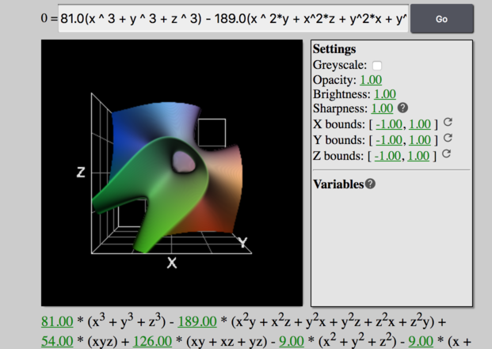

# glsl-function-grapher
Raycasting based 3D function grapher using GLSL

Links:
- [app page](https://mfirmin.github.io/glsl-function-grapher)
- [blog article](https://blog.mfirmin.ca/glsl-function-grapher)
